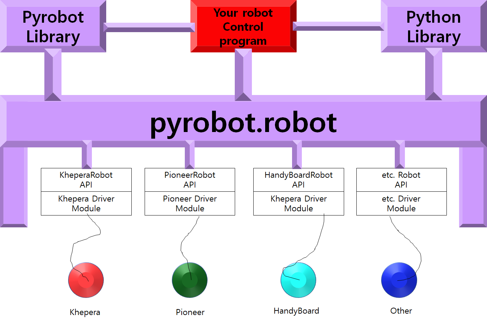

# Pyrobot README File
----------------

It was successfully tested on **Ubuntu 18.04**. 

Following steps are the successful case step. 

### 1. First just clone this project and change this folder name as pyrobot3 -> pyrobot `mv pyrobot3 pyrobot`

### 2. `cd /pyrobot/bin/` and `python3 pyrobot` 

### 3. Click Server: and choose PyrobotSimulator and choose Tutorial.py as a World. You should get a window showing a top view of a simulated room containing a robot and a few walls.

### 4. In the interface window, click Robot: and choose PyrobotRobot60000.py

### 5. Click Brain: and choose Avoid.py

### 6. Click Run to make the robot wander around the simulated room

# Modules

## World

pyrbot map

## Robot

## Plugin

# Combination of available plugins

| world           | robot          | plugin                                          |
| --------------- | -------------- | -----------------                               |
| AndrewHallway   | pyrobot60000   | Subsumption.py                                  |
| AndrewHallway   | pyrobot60000   | Slider.py                                       |
| AndrewHallway   | pyrobot60000   | SimpleWander.py   ( just wander around )        |
| AndrewHallway   | pyrobot60000   | SimpleBrain.py (It dosen't have any brain logic |
| AndrewHallway   | pyrobot60000   | Subsumption                                     |
|Braitenberg2Lights1Robot.py |pyrobot60000||
|Myro3DWorld |pyrobot60000||
|Challenge2 |pyrobot60000||
|AndrewHallway3 |pyrobot60000||
|Tutorial |pyrobot60000||
|AndrewHallway |pyrobot60000||
|LightBehindCorral |pyrobot60000||
|LightInCorral |pyrobot60000||
|WumpusWorld |pyrobot60000||
|LongHall |pyrobot60000||
|LightEnclosed |pyrobot60000||
|Braitenberg |pyrobot60000||
|Braitenberg2Lights1Robot2 |pyrobot60000||
|Challenge1 |pyrobot60000||
|Test3D |pyrobot60000||
|BigRoomWithLights2Pioneers |pyrobot60000||
|LongHall4 |pyrobot60000||
|RLWorld |pyrobot60000||
|BigRoom2 |pyrobot60000||
|LightBehindWall |pyrobot60000||
|LightInMaze |pyrobot60000||
|LongHall2 |pyrobot60000||
|KonaneWorld |pyrobot60000||
|MyroWorld |pyrobot60000||
|BigRoomWithLights2Pioneers2 |pyrobot60000||
|Room |pyrobot60000||
|LongHall1 |pyrobot60000||
|Fireflies |pyrobot60000||
|BigRoom |pyrobot60000||
|VacuumCleanerWorld |pyrobot60000||
|LongHall3 |pyrobot60000||
|CamWorld |pyrobot60000||

<!--
   - pyrobot60000 ./plugins/worlds/Pyrobot/AndrewHallway.py 
   - pyrobot60000 ./plugins/brains/Subsumption.py 
   - pyrobot60000 ./plugins/brains/Slider.py
   - pyrobot60000 ./plugins/brains/SimpleWander.py
   - pyrobot60000 ./plugins/brains/SimpleBrain.py
   - pyrobot60000 ./plugins/brains/SimpleBrain.py
   - pyrobot60000
   - ./plugins/worlds/Pyrobot/KonaneWorld.py
   -->

